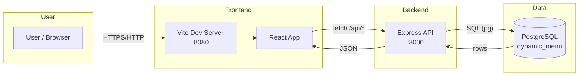

# Dynamic Menu — Restaurant Ordering App

## App Summary

This application solves the problem of digital menu browsing and order placement for sit-down or takeout restaurant service. The primary user is a restaurant customer who wants to view the menu (including allergens and dietary information), build an order, and send it to the kitchen. The product provides a responsive web interface where customers can browse dishes by category (e.g. suggested vs. rest of menu), open item details with descriptions and allergen tags, add items to a cart, and complete checkout by sending the order to the kitchen. Orders are stored in a PostgreSQL database so the restaurant can track completed orders and line items. The app is designed for a single restaurant (e.g. “The Morning Table”) with a full stack: React frontend, Express backend, and PostgreSQL database.

## Tech Stack

| Layer | Technologies |
|-------|--------------|
| **Frontend** | React 18, TypeScript, Vite, React Router, TanStack Query, Tailwind CSS, shadcn/ui, Lucide icons |
| **Backend** | Node.js, Express, `pg` (node-postgres), `cors`, `dotenv` |
| **Database** | PostgreSQL (database name: `dynamic_menu`) |
| **Authentication** | None (no login; in-restaurant ordering) |
| **External services / APIs** | None |

## Architecture Diagram



- **User** opens the app in a browser.
- **Frontend** (Vite + React) serves the UI and calls the backend over HTTP.
- **Backend** (Express) handles REST endpoints, runs SQL via `pg`, and returns JSON.
- **Database** (PostgreSQL) stores restaurants, menu items, allergens, completed orders, and order line items.

## Prerequisites

Install the following and ensure they are available in your system PATH:

| Software | Purpose | Install | Verify |
|----------|---------|---------|--------|
| **Node.js** (LTS) | Run frontend and backend | [nodejs.org](https://nodejs.org/) or [nvm](https://github.com/nvm-sh/nvm#installing-and-updating) | `node -v` and `npm -v` |
| **PostgreSQL** | Database server | [PostgreSQL downloads](https://www.postgresql.org/download/) | `psql --version` |
| **psql** | Run schema/seed scripts (included with PostgreSQL) | Same as PostgreSQL | `psql --version` |

- **Node.js**: required for `npm install` and running the frontend and backend.
- **PostgreSQL**: must be installed and running; the app uses a database named `dynamic_menu`.
- **psql**: must be on your PATH so you can run `schema.sql` and `seed.sql` from the command line (or use the backend setup script).

## Installation and Setup

1. **Clone the repository**
   ```bash
   git clone <YOUR_GIT_URL>
   cd figma-prototype-showcase
   ```

2. **Install frontend dependencies** (from project root)
   ```bash
   npm install
   ```

3. **Install backend dependencies**
   ```bash
   cd backend
   npm install
   cd ..
   ```

4. **Create the database**
   - Start PostgreSQL, then create the database:
   ```bash
   createdb dynamic_menu
   ```
   - Or in psql: `CREATE DATABASE dynamic_menu;`

5. **Run the schema and seed**
   - From the **project root** (directory that contains `db/`):
   ```bash
   psql -h localhost -p 5432 -U postgres -d dynamic_menu -f db/schema.sql
   psql -h localhost -p 5432 -U postgres -d dynamic_menu -f db/seed.sql
   ```
   - On Windows you may need to set the password first:
   - **PowerShell:** `$env:PGPASSWORD = 'your_postgres_password'`
   - **Cmd:** `set PGPASSWORD=your_postgres_password`
   - Alternatively, from the `backend` folder you can run: `npm run setup-db` (requires dependencies installed and a `.env` at project root with `DB_PASSWORD` set).

6. **Configure environment variables**
   - Copy the example env file and edit it:
   ```bash
   cp .env.example .env
   ```
   - Edit `.env` in the **project root** and set at least:
     - `DB_PASSWORD` — your PostgreSQL password (must be a string; the backend reads this from the root `.env`).
     - Optionally `VITE_API_URL=http://localhost:3000` so the frontend knows where the API is.
   - The backend loads `.env` from the project root; do not put secrets in `backend/.env` unless you also update the backend’s `dotenv.config` path.

## Running the Application

1. **Start the backend** (from project root)
   ```bash
   cd backend
   npm run dev
   ```
   - You should see: `Server is running on http://localhost:3000`
   - Leave this terminal open.

2. **Start the frontend** (from project root, in a new terminal)
   ```bash
   npm run dev
   ```
   - Vite will print a URL, usually: **http://localhost:8080**

3. **Open the app**
   - In your browser, go to **http://localhost:8080** (or the URL Vite shows).
   - You should see the restaurant name and menu loaded from the database.

## Verifying the Vertical Slice

This demonstrates the full path: **UI → API → Database → persistence**.

1. **Trigger the feature**
   - Open http://localhost:8080.
   - Add at least one item to the order (e.g. “Avocado Toast” — click the item, then “Add to Order”, or use the + on a menu card).
   - Go to **Your Order** (e.g. order link in nav), then **Proceed to Checkout**.
   - On the checkout page, click **Send to Kitchen**.

2. **Confirm the database was updated**
   - In PostgreSQL, run:
   ```bash
   psql -h localhost -p 5432 -U postgres -d dynamic_menu -c "SELECT * FROM completed_orders ORDER BY order_id DESC LIMIT 3;"
   ```
   - You should see a new row with the latest `order_id`, `restaurant_id`, `order_type`, and `total_price`.
   - Check line items:
   ```bash
   psql -h localhost -p 5432 -U postgres -d dynamic_menu -c "SELECT * FROM active_orders ORDER BY order_item_id DESC LIMIT 5;"
   ```
   - New rows should reference the new `order_id` and the menu items you added.

3. **Verify the change persists after refresh**
   - Refresh the browser (F5 or reload).
   - The order summary on the app will be cleared (by design), but the data remains in the database.
   - Run the `SELECT` commands above again; the same new rows remain in `completed_orders` and `active_orders`. That confirms the vertical slice from UI through API to PostgreSQL is working and persistent.
